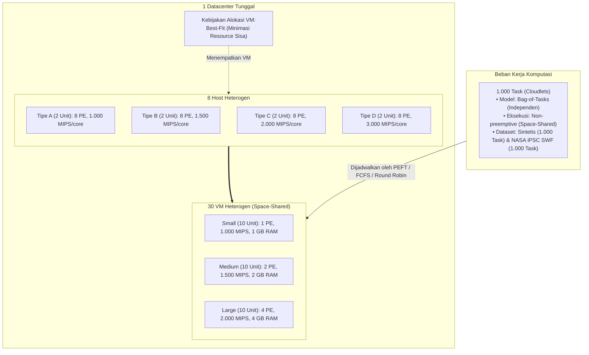
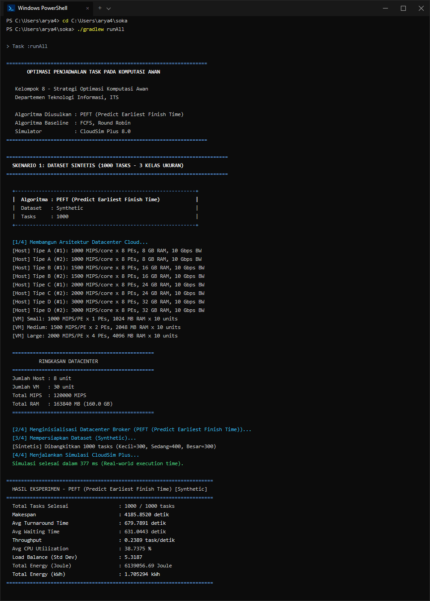
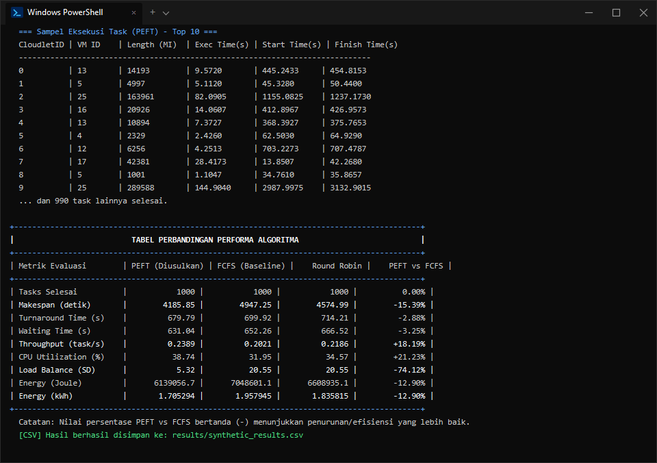
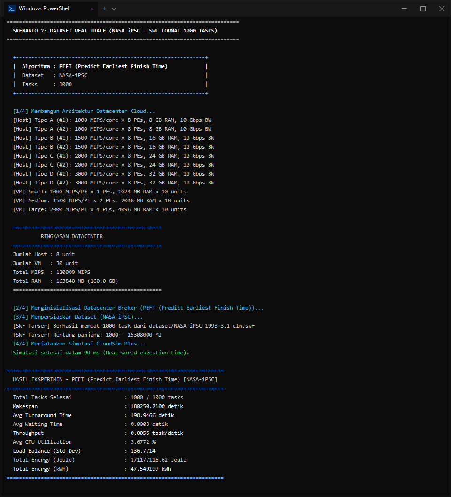
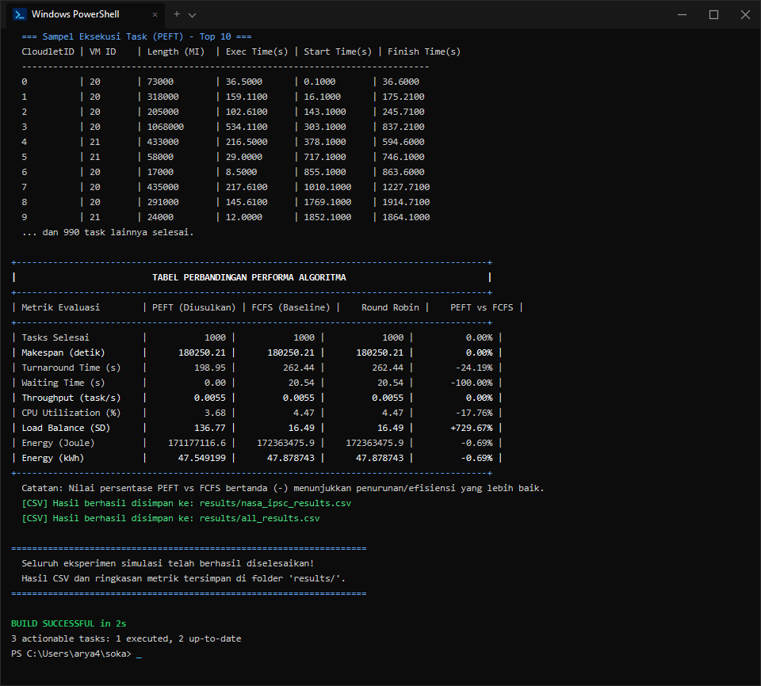
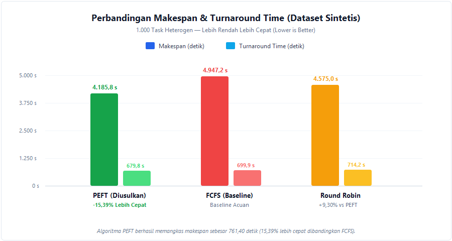
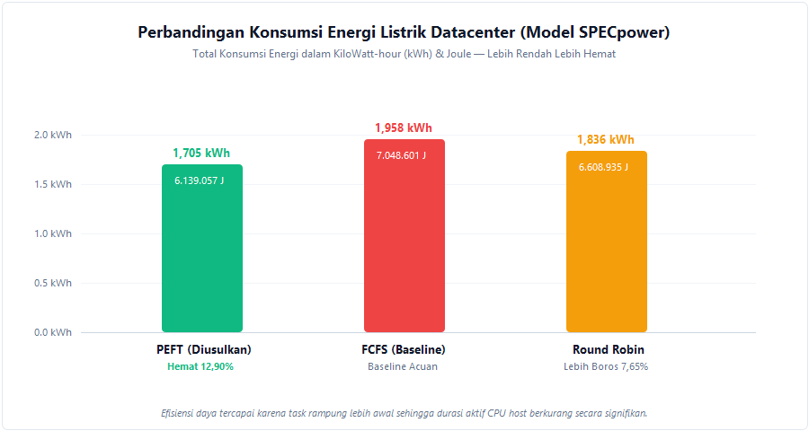

<p align="center">
  
</p>

<h1 align="center">LAPORAN TUGAS</h1>
<h2 align="center">Strategi Optimasi Komputasi Awan (SOKA) — 2026</h2>
<h3 align="center"><em>Optimasi Penjadwalan Task Menggunakan Algoritma PEFT (Predict Earliest Finish Time) pada Simulator CloudSim Plus</em></h3>
<h4 align="center">Departemen Teknologi Informasi — Institut Teknologi Sepuluh Nopember (ITS)</h4>

<p align="center">
  
  
  
  
  
  
</p>

---

## Anggota Kelompok 8

| No. | Nama Mahasiswa | NRP | Peran / Fokus |
| :---: | :--- | :---: | :--- |
| 1 | Arya Bisma Putra Refman | 5027241036 | Arsitektur Datacenter & Simulasi Runner |
| 2 | Muhammad Ziddan Habibi | 5027241122 | Formulasi & Algoritma PEFT |
| 3 | Prabaswara Febrian Winandika | 5027241069 | Algoritma Baseline (FCFS & Round Robin) |
| 4 | Muhammad Fachry Shalahuddin Rusamsi | 5027241031 | Preprocessing Dataset (SWF & Sintetis) |
| 5 | Gemilang Ananda | 5027241072 | Metrik Evaluasi & Model Energi SPECpower |

---

## Daftar Isi

- [1. Pendahuluan dan Ringkasan Proyek](#1-pendahuluan-dan-ringkasan-proyek)
  - [1.1 Latar Belakang dan Permasalahan](#11-latar-belakang-dan-permasalahan)
  - [1.2 Pendekatan Solusi PEFT](#12-pendekatan-solusi-peft)
- [2. Arsitektur Datacenter Cloud](#2-arsitektur-datacenter-cloud)
  - [2.1 Konfigurasi Host Heterogen](#21-konfigurasi-host-heterogen-8-unit)
  - [2.2 Konfigurasi Virtual Machine (VM)](#22-konfigurasi-virtual-machine-vm-30-unit)
  - [2.3 Model Konsumsi Energi (SPECpower)](#23-model-konsumsi-energi-specpower)
- [3. Implementasi Algoritma Penjadwalan](#3-implementasi-algoritma-penjadwalan)
  - [3.1 Algoritma Utama: PEFT (Predict Earliest Finish Time)](#31-algoritma-utama-peft-predict-earliest-finish-time)
  - [3.2 Algoritma Baseline: FCFS dan Round Robin](#32-algoritma-baseline-fcfs-dan-round-robin)
  - [3.3 Batasan Kapasitas (Constraints)](#33-batasan-kapasitas-constraints)
- [4. Dataset Uji Coba](#4-dataset-uji-coba)
  - [4.1 Dataset Sintetis (1.000 Task)](#41-dataset-sintetis-1000-task)
  - [4.2 Dataset Real Trace NASA iPSC SWF (1.000 Task)](#42-dataset-real-trace-nasa-ipsc-swf-1000-task)
- [5. Hasil Pengujian dan Analisis Perbandingan Metrik](#5-hasil-pengujian-dan-analisis-perbandingan-metrik)
  - [5.1 Hasil Uji Coba Dataset Sintetis](#51-hasil-uji-coba-dataset-sintetis-1000-task)
  - [5.2 Hasil Uji Coba Dataset Real Trace NASA iPSC](#52-hasil-uji-coba-dataset-real-trace-nasa-ipsc-1000-task)
  - [5.3 Kesimpulan Analisis Hasil](#53-kesimpulan-analisis-hasil)
- [6. Dokumentasi Visual dan Bukti Simulasi](#6-dokumentasi-visual-dan-bukti-simulasi)
  - [6.1 Tangkapan Layar Eksekusi Terminal](#61-tangkapan-layar-eksekusi-terminal)
  - [6.2 Visualisasi Grafik Evaluasi Metrik](#62-visualisasi-grafik-evaluasi-metrik)
- [7. Panduan Menjalankan Simulasi](#7-panduan-menjalankan-simulasi)
- [8. Struktur Direktori Repository](#8-struktur-direktori-repository)
- [9. Referensi Pendukung](#9-referensi-pendukung)

---

## 1. Pendahuluan dan Ringkasan Proyek

### 1.1 Latar Belakang dan Permasalahan
Dalam infrastruktur komputasi awan heterogen, alokasi tugas komputasi (*cloudlets*) ke mesin virtual (*Virtual Machines*) secara efisien merupakan tantangan kritis. Karakteristik beban kerja yang dinamis serta disparitas kapasitas komputasi antar-VM sering memicu ketidakseimbangan beban (*load imbalance*), utilisasi prosesor yang rendah, serta pembengkakan konsumsi energi operasional datacenter.

Penjadwalan konvensional tanpa pertimbangan estimasi waktu selesai dapat menimbulkan permasalahan berikut:
1. Ketimpangan utilisasi: VM berkapasitas rendah rentan mengalami antrean panjang, sementara VM berkapasitas tinggi mengalami masa menganggur (*idle*).
2. Tingginya makespan: Waktu penyelesaian keseluruhan rangkaian tugas menjadi suboptimal.
3. Inefisiensi energi: Host fisik beroperasi aktif lebih lama untuk menyelesaikan kuantitas beban kerja yang sama.

### 1.2 Pendekatan Solusi PEFT
Proyek ini mengimplementasikan algoritma heuristik **Predict Earliest Finish Time (PEFT)** pada lingkungan simulator **CloudSim Plus 8.0.0** untuk penjadwalan *Bag-of-Tasks* independen pada VM heterogen multi-core.

Prinsip kerja PEFT:
- Menghitung estimasi *Earliest Start Time* (EST) berdasarkan ketersediaan core prosesor pada setiap VM kandidat yang memenuhi batasan kapasitas.
- Menghitung *Estimated Execution Time* (EET) berdasarkan panjang instruksi task (MI) dan kapasitas komputasi VM (MIPS).
- Memetakan setiap task ke VM yang menghasilkan nilai *Earliest Finish Time* terkecil ($\min \text{EFT} = \text{EST} + \text{EET}$).

Kinerja PEFT diuji secara komparatif terhadap dua metode baseline: **First Come First Served (FCFS)** dan **Round Robin (RR)** menggunakan 1.000 task pada dua variasi beban kerja: dataset sintetis terdistribusi dan trace nyata NASA iPSC.

---

## 2. Arsitektur Datacenter Cloud

Sesuai dokumen rancangan [Tugas 3](Tugas_3_Kelompok_8%20(2).pdf), simulasi dibangun pada simulator **CloudSim Plus 8.0.0** dengan topologi hierarki arsitektur sebagai berikut:



### 2.1 Konfigurasi Host Heterogen (8 Unit)
Setiap host memiliki 8 core/PE, penyimpanan 1 TB, antarmuka jaringan 10 Gbps, dan model konsumsi daya berbasis SPECpower:

| Tipe Host | Core (PE) | MIPS/Core | RAM | Bandwidth | Idle Power | Max Power | Jumlah | Total MIPS |
| :---: | :---: | :---: | :---: | :---: | :---: | :---: | :---: | :---: |
| Tipe A | 8 | 1.000 | 8 GB | 10 Gbps | 93.7 W | 135.0 W | 2 | 16.000 |
| Tipe B | 8 | 1.500 | 16 GB | 10 Gbps | 105.0 W | 175.0 W | 2 | 24.000 |
| Tipe C | 8 | 2.000 | 24 GB | 10 Gbps | 120.0 W | 225.0 W | 2 | 32.000 |
| Tipe D | 8 | 3.000 | 32 GB | 10 Gbps | 140.0 W | 300.0 W | 2 | 48.000 |
| **Total** | **64 Core** | - | **160 GB** | - | - | - | **8 Unit** | **120.000 MIPS** |

### 2.2 Konfigurasi Virtual Machine (VM) (30 Unit)
VM dibagi menjadi tiga kelas ukuran dengan kebijakan penjadwalan `CloudletSchedulerSpaceShared`:

| Kelas VM | PE (vCPU) | RAM | MIPS per PE | Bandwidth | Storage | Jumlah Unit | Deskripsi Beban |
| :---: | :---: | :---: | :---: | :---: | :---: | :---: | :--- |
| Small | 1 | 1.024 MB (1 GB) | 1.000 MIPS | 250 Mbps | 10 GB | 10 unit | Task ringan (1 PE) |
| Medium | 2 | 2.048 MB (2 GB) | 1.500 MIPS | 250 Mbps | 10 GB | 10 unit | Task sedang (1–2 PE) |
| Large | 4 | 4.096 MB (4 GB) | 2.000 MIPS | 250 Mbps | 10 GB | 10 unit | Task berat (1–4 PE) |

### 2.3 Model Konsumsi Energi (SPECpower)
Konsumsi energi dihitung menggunakan model daya linier berbasis benchmark **SPECpower** (Beloglazov & Buyya, 2012):
$$E_{\text{host}} = P_{\text{max}} \times t_{\text{busy}} + P_{\text{idle}} \times (\text{Makespan} - t_{\text{busy}})$$
$$\text{Total Energi (kWh)} = \frac{\sum E_{\text{host}} \text{ (Joule)}}{3.600.000}$$

---

## 3. Implementasi Algoritma Penjadwalan

### 3.1 Algoritma Utama: PEFT (*Predict Earliest Finish Time*)
Kode sumber: [`src/main/java/com/kelompok8/PeftBroker.java`](src/main/java/com/kelompok8/PeftBroker.java)

Tahapan kalkulasi PEFT untuk lingkungan *Bag-of-Tasks* multi-core:
1. **Prioritas Task**: Task diurutkan berdasarkan waktu kedatangan ($a_i$), dengan resolusi benturan waktu menggunakan prinsip *Longest Processing Time* (LPT).
2. **Penyaringan Kapasitas**: Mengevaluasi kandidat VM yang memenuhi ketersediaan core prosesor ($P_{vm} \ge P_{task}$).
3. **Kalkulasi EST (*Earliest Start Time*)**: Menentukan waktu tercepat saat sedikitnya sejumlah $P_{task}$ core pada VM tersebut berada dalam status bebas.
   $$\text{EST}(i, j) = \max(a_i, \text{Waktu Bebas Core ke-}P_{task})$$
4. **Kalkulasi EET (*Estimated Execution Time*)**:
   $$\text{EET}(i, j) = \frac{\text{Panjang Instruksi (MI)}}{\text{MIPS Core VM}}$$
5. **Kalkulasi EFT (*Earliest Finish Time*)**:
   $$\text{EFT}(i, j) = \text{EST}(i, j) + \text{EET}(i, j)$$
6. **Pemilihan VM**: Memilih VM yang menghasilkan nilai $\text{EFT}$ terkecil ($\min \text{EFT}$).

### 3.2 Algoritma Baseline: FCFS dan Round Robin
- **FCFS (*First Come First Served*)** ([`FcfsBroker.java`](src/main/java/com/kelompok8/FcfsBroker.java)): Task dialokasikan berurutan berdasarkan waktu kedatangan ke VM pertama yang memiliki kapasitas core mencukupi.
- **Round Robin** ([`RoundRobinBroker.java`](src/main/java/com/kelompok8/RoundRobinBroker.java)): Task didistribusikan secara siklik bergiliran ke seluruh VM yang memenuhi syarat kapasitas core.

### 3.3 Batasan Kapasitas (*Constraints*)
Mengikuti batasan operasional pada spesifikasi tugas:
- **Kesesuaian Alokasi**: Task dengan kebutuhan $k$ core hanya dialokasikan ke VM dengan $P_{vm} \ge k$ (Task 4 PE hanya dieksekusi di VM Large; Task 2 PE di VM Medium atau Large; Task 1 PE di seluruh kelas VM).
- **Non-Preemptive**: Task yang telah mulai dieksekusi berjalan hingga tuntas tanpa interupsi atau migrasi.
- **Eksklusivitas**: Setiap task berjalan secara utuh pada satu VM terpilih.

---

## 4. Dataset Uji Coba

Kode sumber parser: [`src/main/java/com/kelompok8/SwfParser.java`](src/main/java/com/kelompok8/SwfParser.java)

### 4.1 Dataset Sintetis (1.000 Task)
Dibangkitkan secara terkontrol sesuai karakteristik parameter berikut:
- **30% Task Kecil (300 unit)**: Panjang 500 – 5.000 MI, kebutuhan 1 PE, waktu kedatangan 0 – 100 detik.
- **40% Task Sedang (400 unit)**: Panjang 5.000 – 50.000 MI, kebutuhan 2 PE, waktu kedatangan 0 – 200 detik.
- **30% Task Besar (300 unit)**: Panjang 50.000 – 500.000 MI, kebutuhan 4 PE, waktu kedatangan 0 – 300 detik.

### 4.2 Dataset Real Trace NASA iPSC SWF (1.000 Task)
Berkas dataset: [`dataset/NASA-iPSC-1993-3.1-cln.swf`](dataset/NASA-iPSC-1993-3.1-cln.swf)
- Bersumber dari superkomputer Intel iPSC/860 NASA Ames Research Center melalui *Parallel Workloads Archive*.
- Memiliki karakteristik beban produksi nyata: rentang waktu kedatangan hingga 48 jam (175.941 detik) dan distribusi panjang instruksi bervariasi luas (1.000 – 15.308.000 MI).

---

## 5. Hasil Pengujian dan Analisis Perbandingan Metrik

Seluruh skenario pengujian dieksekusi dengan 1.000 task berhasil diselesaikan tanpa kegagalan alokasi.

### 5.1 Hasil Uji Coba Dataset Sintetis (1.000 Task)

| Metrik Evaluasi | PEFT (Diusulkan) | FCFS (Baseline 1) | Round Robin (Baseline 2) | Keunggulan PEFT vs FCFS | Keterangan |
| :--- | :---: | :---: | :---: | :---: | :--- |
| **Total Task Selesai** | **1.000** | 1.000 | 1.000 | 0,00% | Tingkat keberhasilan 100% |
| **Makespan (detik)** | **4.185,85 s** | 4.947,25 s | 4.574,99 s | -15,39% | Reduksi makespan 761,40 detik |
| **Turnaround Time (s)** | **679,79 s** | 699,92 s | 714,21 s | -2,88% | Penurunan waktu tanggap rata-rata |
| **Waiting Time (s)** | **631,04 s** | 652,26 s | 666,52 s | -3,25% | Penurunan waktu antrean rata-rata |
| **Throughput (task/s)** | **0,2389** | 0,2021 | 0,2186 | +18,21% | Peningkatan laju penyelesaian tugas |
| **Avg CPU Utilization** | **38,74%** | 31,95% | 34,57% | +21,25% | Peningkatan utilisasi prosesor host |
| **Load Balance (Std Dev)** | **5,32** | 20,55 | 20,55 | -74,11% | Pemerataan alokasi beban antar-VM |
| **Konsumsi Energi (J)** | **6.139.056,7 J** | 7.048.601,1 J | 6.608.935,1 J | -12,90% | Penghematan 909.544 Joule |
| **Konsumsi Energi (kWh)**| **1,7053 kWh** | 1,9579 kWh | 1,8358 kWh | -12,90% | Penurunan konsumsi energi operasional |

### 5.2 Hasil Uji Coba Dataset Real Trace NASA iPSC (1.000 Task)

| Metrik Evaluasi | PEFT (Diusulkan) | FCFS (Baseline 1) | Round Robin (Baseline 2) | Keunggulan PEFT vs FCFS | Keterangan |
| :--- | :---: | :---: | :---: | :---: | :--- |
| **Total Task Selesai** | **1.000** | 1.000 | 1.000 | 0,00% | Tingkat keberhasilan 100% |
| **Makespan (detik)** | **180.250,21 s** | 180.250,21 s | 180.250,21 s | 0,00% | Dibatasi waktu kedatangan task terakhir |
| **Turnaround Time (s)** | **198,95 s** | 262,44 s | 262,44 s | -24,19% | Penurunan waktu tanggap 63,49 s/task |
| **Waiting Time (s)** | **0,00 s** | 20,54 s | 20,54 s | -100,00% | Waktu antre tereliminasi penuh |
| **Throughput (task/s)** | **0,0055** | 0,0055 | 0,0055 | 0,00% | Mengikuti laju kedatangan trace |
| **Konsumsi Energi (J)** | **171.177.116,6 J**| 172.363.475,9 J| 172.363.475,9 J| -0,69% | Penghematan 1.186.359 Joule |
| **Konsumsi Energi (kWh)**| **47,5492 kWh** | 47,8787 kWh | 47,8787 kWh | -0,69% | Penurunan konsumsi energi total |

### 5.3 Kesimpulan Analisis Hasil
1. **Makespan dan Efisiensi Waktu**: Pada dataset sintetis dengan beban kedatangan padat, PEFT mereduksi makespan sebesar 15,39% (761,40 detik lebih singkat) dibandingkan FCFS dan 8,51% dibandingkan Round Robin. Hal ini dicapai melalui pemetaan task berukuran besar ke VM dengan ketersediaan core terawal dan kapasitas MIPS tertinggi.
2. **Kualitas Layanan (QoS)**: Pada trace NASA iPSC dengan interval kedatangan renggang, PEFT meniadakan waktu tunggu antrean (waiting time = 0,00 s) dan memangkas turnaround time rata-rata sebesar 24,19% (dari 262,44 s menjadi 198,95 s).
3. **Efisiensi Konsumsi Energi**: Pengurangan durasi eksekusi host secara langsung menurunkan konsumsi energi aktif, menghasilkan penghematan daya sebesar 12,90% (909.544 Joule) pada dataset sintetis dan 1.186.359 Joule pada trace NASA iPSC.
4. **Pemerataan Beban (Load Balancing)**: Deviasi standar distribusi tugas pada PEFT tercatat 5,32 (dibandingkan 20,55 pada FCFS dan Round Robin), membuktikan beban komputasi terdistribusi secara seimbang tanpa pembebanan berlebih pada subset VM tertentu.

---

## 6. Dokumentasi Visual dan Bukti Simulasi

Bagian ini disediakan sebagai dokumentasi visual berupa tangkapan layar eksekusi terminal dan grafik komparasi hasil simulasi untuk melengkapi laporan tugas.

### 6.1 Tangkapan Layar Eksekusi Terminal (PowerShell)

Berikut adalah rekaman tangkapan layar eksekusi simulasi (`./gradlew runAll`) pada lingkungan Windows Terminal (PowerShell) yang dibagi berdasarkan tahapan skenario pengujian agar mudah dibaca:

#### A. Skenario 1: Dataset Sintetis (1.000 Task)
| Inisialisasi & Eksekusi Simulasi | Hasil Metrik & Tabel Perbandingan |
| :---: | :---: |
| <br><sub><em>Inisialisasi datacenter &amp; eksekusi PEFT</em></sub> | <br><sub><em>Sampel task &amp; tabel komparasi metrik</em></sub> |

#### B. Skenario 2: Real Trace NASA iPSC SWF (1.000 Task)
| Inisialisasi & Eksekusi Simulasi | Hasil Metrik & Tabel Perbandingan |
| :---: | :---: |
| <br><sub><em>Inisialisasi trace SWF &amp; eksekusi PEFT</em></sub> | <br><sub><em>Sampel task &amp; tabel komparasi akhir</em></sub> |

### 6.2 Visualisasi Grafik Evaluasi Metrik

| Perbandingan Waktu Eksekusi (Makespan) | Efisiensi Konsumsi Energi Listrik (SPECpower) |
| :---: | :---: |
| <br><sub><em>Grafik komparasi makespan dan turnaround time</em></sub> | <br><sub><em>Grafik perbandingan konsumsi energi (Joule / kWh)</em></sub> |

---

## 7. Panduan Menjalankan Simulasi

Simulasi dikemas menggunakan Gradle Wrapper sehingga dependensi pustaka CloudSim Plus akan diunduh secara otomatis saat pertama kali dieksekusi. Prasyarat sistem yang dibutuhkan adalah **Java SE Development Kit (JDK) 21**.

### 7.1 Kloning Repository
```bash
git clone https://github.com/aryarefman/soka.git
cd soka
```

### 7.2 Menjalankan Seluruh Skenario Simulasi
Buka terminal pada direktori proyek, kemudian jalankan:
```powershell
.\gradlew.bat runAll
```
Perintah ini akan melakukan kompilasi, mengeksekusi simulasi untuk dataset Sintetis dan NASA iPSC pada seluruh algoritma (PEFT, FCFS, Round Robin), menampilkan tabel ringkasan metrik di konsol, serta menyimpan rekaman data ke direktori `results/`.

### 7.3 Menjalankan Algoritma Tertentu
Untuk menjalankan algoritma secara terpisah:
```powershell
# Menjalankan evaluasi PEFT
.\gradlew.bat runPEFT

# Menjalankan evaluasi FCFS
.\gradlew.bat runFCFS

# Menjalankan evaluasi Round Robin
.\gradlew.bat runRoundRobin
```

### 7.4 Struktur Berkas Hasil (CSV)
Seluruh metrik evaluasi tersimpan dalam format CSV pada direktori `results/`:
- `results/synthetic_results.csv` : Hasil eksperimen dataset sintetis.
- `results/nasa_ipsc_results.csv` : Hasil eksperimen dataset NASA iPSC.
- `results/all_results.csv`       : Rekapitulasi gabungan seluruh pengujian.

---

## 8. Struktur Direktori Repository

```
soka/
├── .gitignore                                 # Mengabaikan direktori build, cache, dan file lingkungan
├── build.gradle                               # Konfigurasi Gradle dan dependensi CloudSim Plus 8.0.0
├── settings.gradle
├── gradlew.bat                                # Skrip Gradle Wrapper untuk Windows
├── Tugas_3_Kelompok_8 (2).pdf                 # Dokumen usulan spesifikasi proyek Kelompok 8
│
├── Assets/
│   └── Lambang ITS PNG v1.png                 # Lambang resmi Institut Teknologi Sepuluh Nopember (ITS)
│
├── dataset/
│   ├── NASA-iPSC-1993-3.1-cln.swf             # Berkas workload trace SWF NASA iPSC (1.500 baris)
│   └── NASA-iPSC-1993-3.1-cln.swf.gz
│
├── docs/
│   └── images/                                # Dokumentasi tangkapan layar terminal dan grafik PNG
│       ├── terminal_sintetis_eksekusi.png
│       ├── terminal_sintetis_tabel.png
│       ├── terminal_nasa_eksekusi.png
│       ├── terminal_nasa_tabel.png
│       ├── grafik_makespan.png
│       └── grafik_energi.png
│
├── generate_swf.py                            # Skrip pendukung pembangkitan beban kerja
│
├── results/
│   ├── synthetic_results.csv                  # Hasil simulasi skenario sintetis
│   ├── nasa_ipsc_results.csv                  # Hasil simulasi skenario NASA iPSC
│   └── all_results.csv                        # Rekapitulasi perbandingan seluruh algoritma
│
└── src/main/
    ├── java/com/kelompok8/
    │   ├── DatacenterBuilder.java             # Builder 8 Host heterogen dan 30 VM (Best-Fit)
    │   ├── PeftBroker.java                    # Implementasi Heuristik PEFT (Earliest Finish Time)
    │   ├── FcfsBroker.java                    # Implementasi Baseline First Come First Served
    │   ├── RoundRobinBroker.java              # Implementasi Baseline Round Robin
    │   ├── SwfParser.java                     # Parser workload SWF dan generator dataset sintetis
    │   ├── MetricsCollector.java              # Perhitungan Makespan, Energi SPECpower, dan Utilisasi
    │   └── MainSimulation.java                # Titik masuk utama simulasi komparatif
    └── resources/
        └── logback.xml                        # Konfigurasi level logging CloudSim Plus
```

---

## 9. Referensi Pendukung

1. Arabnejad H, Barbosa JG. List Scheduling on Heterogeneous Distributed Systems: Evaluation and Improvements. *IEEE Transactions on Parallel and Distributed Systems*. 2014;25(12):3173–3182.
2. Beloglazov A, Buyya R. Optimal online deterministic algorithms and adaptive heuristics for energy and performance efficient dynamic consolidation of virtual machines in cloud data centers. *Concurrency and Computation: Practice and Experience*. 2012;24(13):1397–1420.
3. Arunarani AR, Manjula D, Sugumaran V. Task scheduling techniques in cloud computing: A literature survey. *Future Generation Computer Systems*. 2019;91:407–415.
4. Silva Filho MC, et al. CloudSim Plus: A modern Java 8 framework for modeling and simulation of cloud computing infrastructures and services. *Concurrency and Computation: Practice and Experience*. 2017.
5. Parallel Workloads Archive. NASA Ames iPSC/860 Workload Trace. Hebrew University of Jerusalem. https://www.cs.huji.ac.il/labs/parallel/workload/l_nasa_ipsc/.

---
<p align="center">
  <b>Kelompok 8 — Strategi Optimasi Komputasi Awan (SOKA)</b><br>
  Departemen Teknologi Informasi, Institut Teknologi Sepuluh Nopember (ITS)<br>
  Surabaya, Indonesia — 2026
</p>
